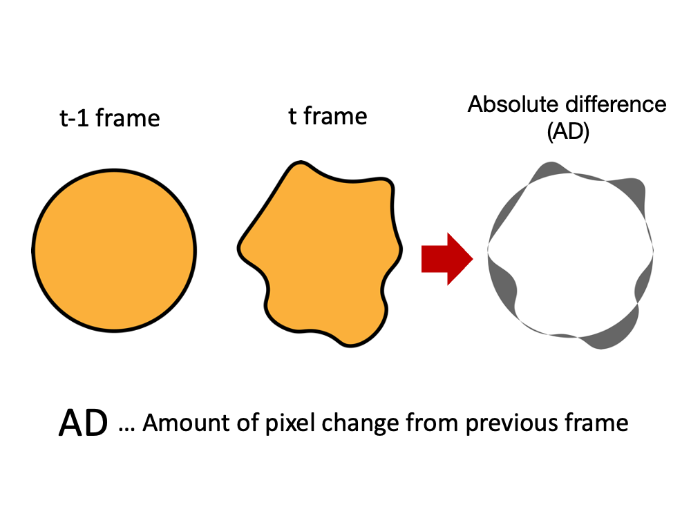
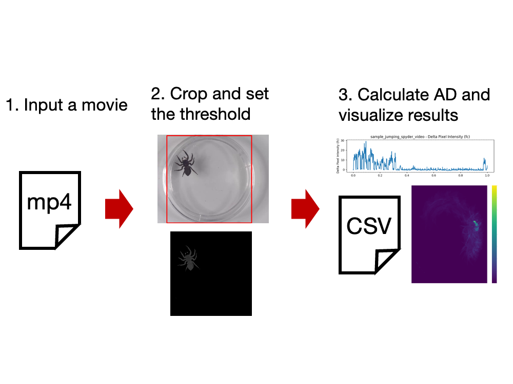
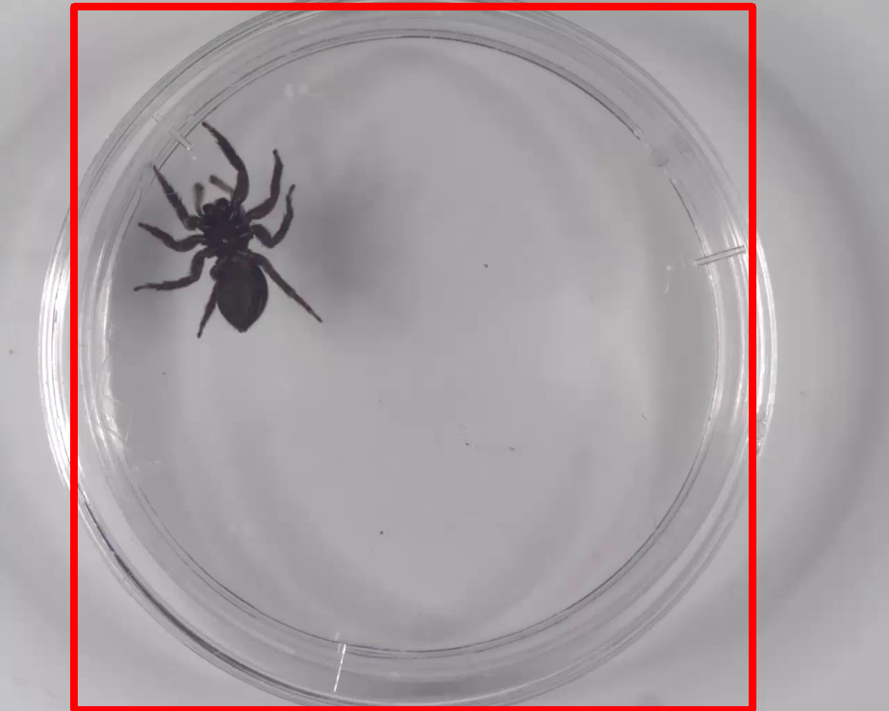
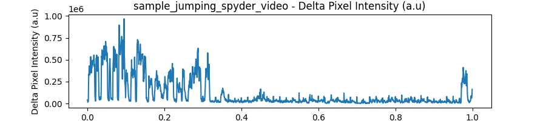

# PixAnalyzer
<!--  -->


PixAnalyzer calculates pixel changes and quantifies the overall motion, which cannot be quantified by tracking or object recognition.

## Docmentation
"PixAnalyzer" is a tool designed to quantify the changes in deformation and movement of an object by measuring the changes in pixel count in an image. Historically, it was challenging to quantify phenomena such as the deformation of an object's overall shape due to difficulties associated with tracking. To address this, we developed a GUI-based software inspired by the method used in [P. Solari et al., 2017](https://journals.plos.org/plosone/article?id=10.1371/journal.pone.0174172) that analyzed the deformation of the Drosophila crop. In our analysis, by setting a specific brightness threshold, only the deformation of the target object is captured. Furthermore, the software provides a graph depicting the pixel change for each frame and exports this data in CSV format.


Pixel change analysis uses the amount of pixel change between previous and current frames.
This system calculate the absolute difference (AD) of pixel by comparing t-1 frame and t frame. AD reflects the amount of deformation, so the more AD is, the more the object is deformed. And the opposite is also true.




## Installation

#### Step1: Clone this repository

#### Step2: Install [Anaconda](https://www.anaconda.com)

#### Step3: Build an environment using the yaml file

In Anacnda prompt
```
  conda env create -f <path/to/environment.yml>
```

#### Step4: Install PixAnalyzer

In Anacnda prompt
```
  conda acitate pixanalyzer
  pip install pixanalyzer
```

#### Step5: Check the initiation of PixAnalyzer

In Anacnda prompt
```
  conda acitate pixanalyzer
  pixanalyzer
```
## How to use

Graphical abstraction of uses


#### Step1: Start PixAnalyzer

In Anacnda prompt
```
  conda acitate pixanalyzer
  pixanalyzer
```

#### Step2: Push "Start Analysis" and Select video files.(*.mp4, *.avi files)

#### Step3: Select crop area using GUI



#### Step4: Select threshold for analyzing motion/deformation of objects
It is recommended that the threshold be set so that the contours of the object are clearly observed and the background is eliminated as much as possible.


#### Step5: Analyze
After analysis, graphs showing the time series of pixel change results, a heatmap, an exel file of the results, and a json file of the configuration values are output.




    
## Demonstration
In the "sampledata" folder, there are analyze sample_jumping_spyder_video.mp4 and other figures.


## Acknowledgements
 We thanks for PhD. Ryoya Tanaka for discussing.


## Release Note
- 2023/10/XX First release (Ver. 1.0)
## Feedback

If you have any feedback, please reach out to us by:

- Opening an issue in the repository

- E-mail: haya.m.yamano.neuro@gmail.com


## License

[MIT](https://choosealicense.com/licenses/mit/)

